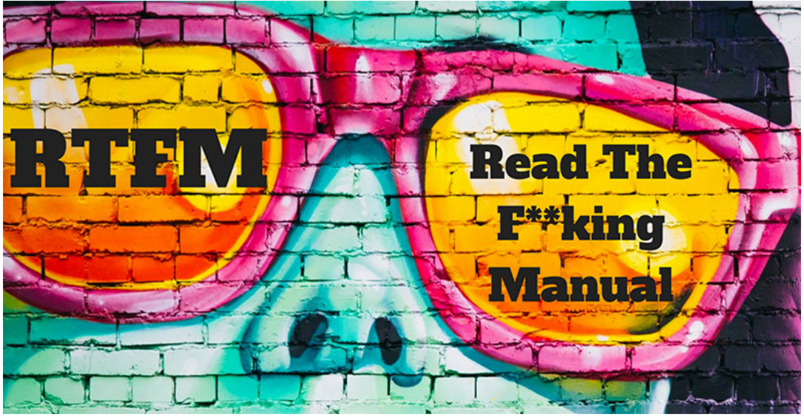

# Shell, basics

100. Moves all files beginning with an uppercase letter to the directory "/tmp/u"

101 Deletes all files in the current working directory that end with the character "~"

102 Creates the directories welcome/, welcome/to/ and welcome/to/school in the current directory.
